#### Projeto Erick Rodrigues Arturiatech

# Loja Virtual
Uma loja virtual simples, para à venda de diversos produtos.
## Configuração
Tenha o [Composer](https://getcomposer.org/) instalado em sua máquina e através de seu terminal entre no diretório do projeto e rode o comando "composer update":
```sh
cd "diretório do projeto"
composer update
```
<br>Tenha o [NodeJS](https://nodejs.org/en) instalado em sua máquina e através de seu terminal entre no diretório do projeto e rode o comando "npm install":
```sh
npm install
```
<br>Vá ao arquivo "storage/database/database.sql" e rode todas as querys que estiverem por lá.<br><br>
Após essa configuração inicial, vá na raiz do projeto e procure pelo diretório "config/", por lá faça as configurações da aplicação, principalmente no arquivo "config/app.php".

## JS & CSS
Caso você queira alterar os estilos(css) ou os scripts(js), saiba que eles ficam localizados dentro da pasta public/assets, porém mesmo que você os altere, essas alterações não irão se refletir na loja, ao menos que você rode os seguintes comandos:

<br>npm run dev - Rode ele se você estiver em modo de desenvolvimento:
```sh
npm run dev
```

<br>npm run build - Rode ele se você estiver em modo de produção:
```sh
npm run build
```

## OBS!!!
Quando você conseguir acessar o painel de controle faça as configurações dos métodos de pagamento na rota "/painel/configuracoes/sistema/loja-online", por padrão os pagamentos vem desabilitados, pela falta das credências que são disponibilizadas nas plataformas de seus respectivos donos que são o pagseguro, mercadopago e picpay

## Informações Adicionais

Template do Site:

### INICIO:

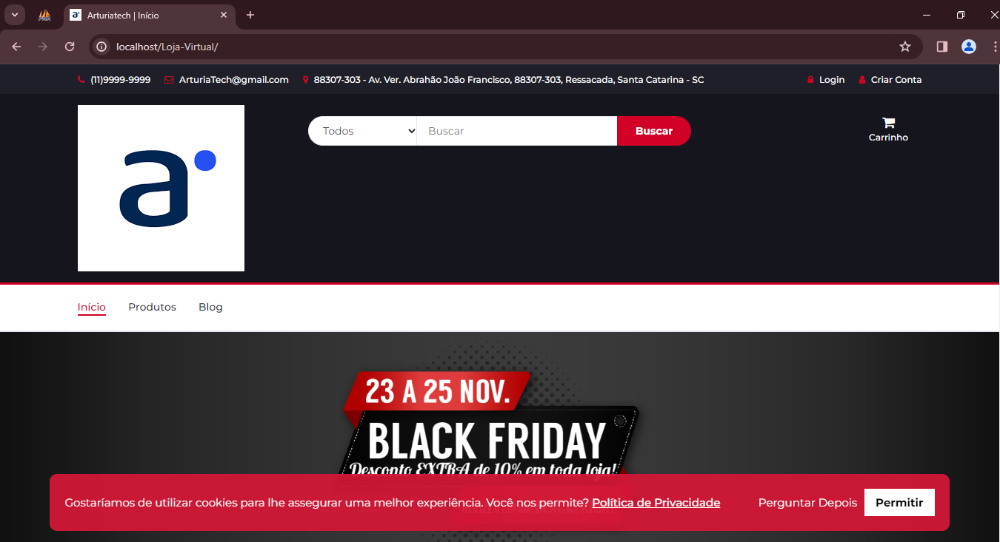

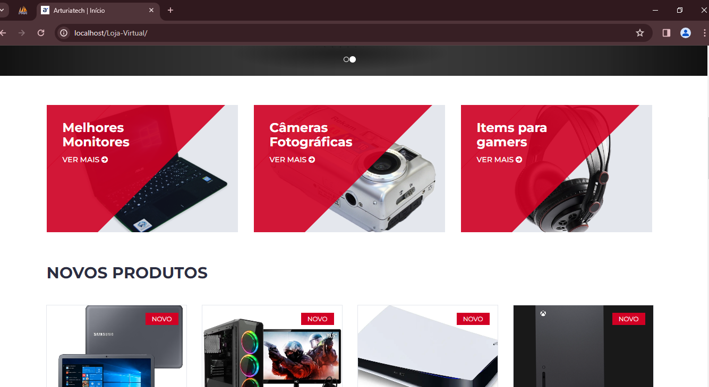

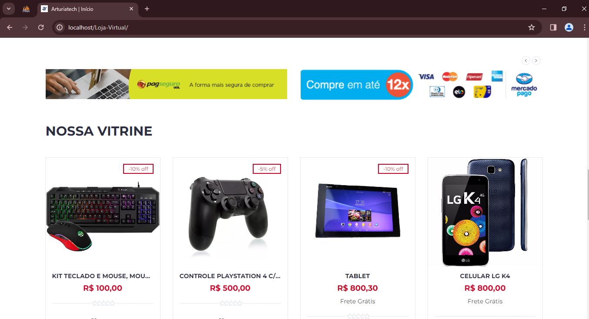


<br>

### CRIEI UMA ABA DE BLOG
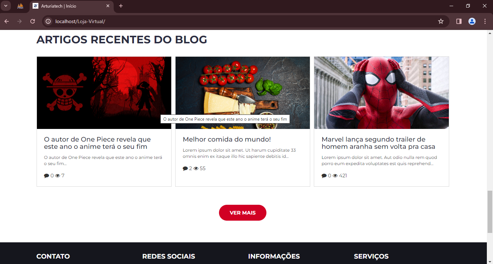


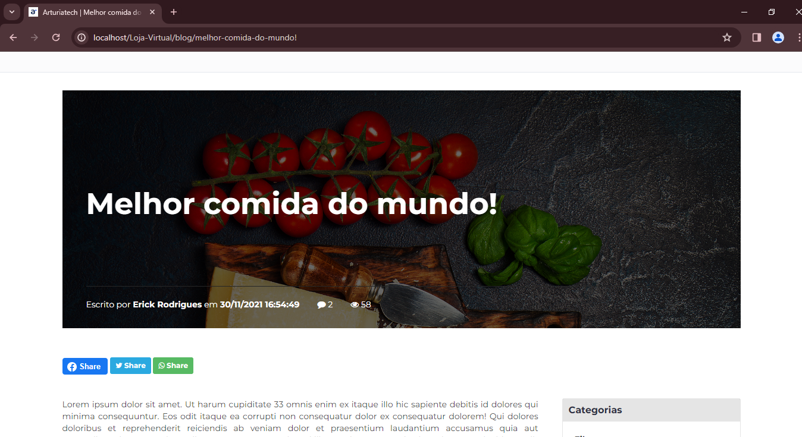
=========================
ABA DE COMENTARIO
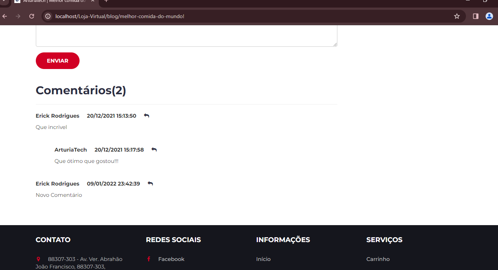

### CRIAR CONTA
==========================
IMPORTANTE CRIAR CONTA PARA REALIZAR COMPRAR DE ALGUM PRODUTO

==========================


### VALIDAÇÃO DE CONTA


### USUÁRIO LOGADO


OBS: precisa estar logado para adicionar produto aos favoritos


### PRODUTOS

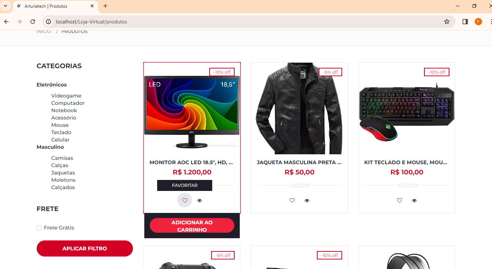

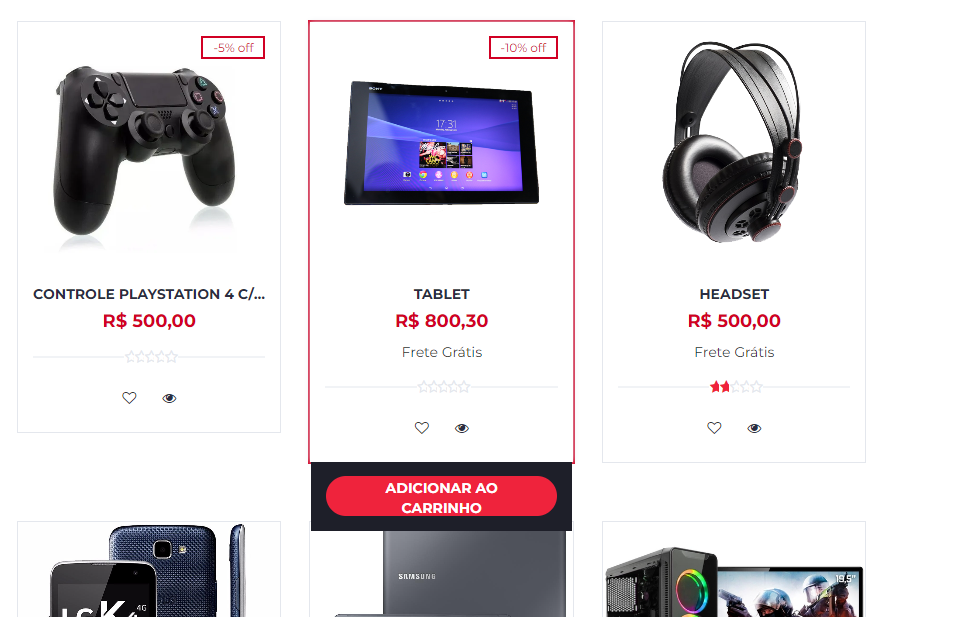

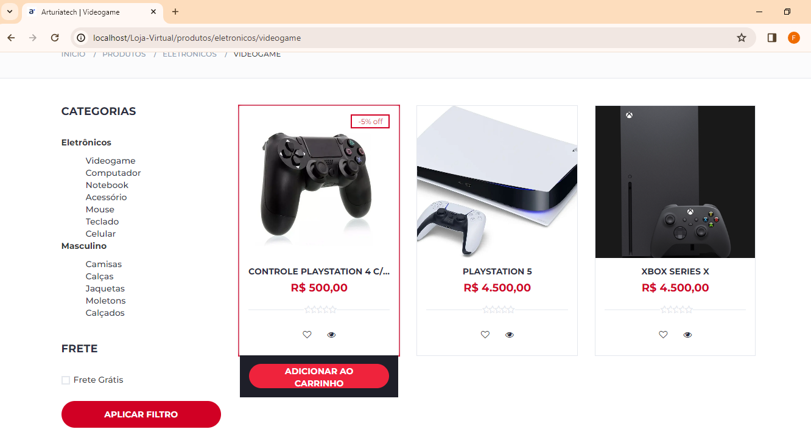

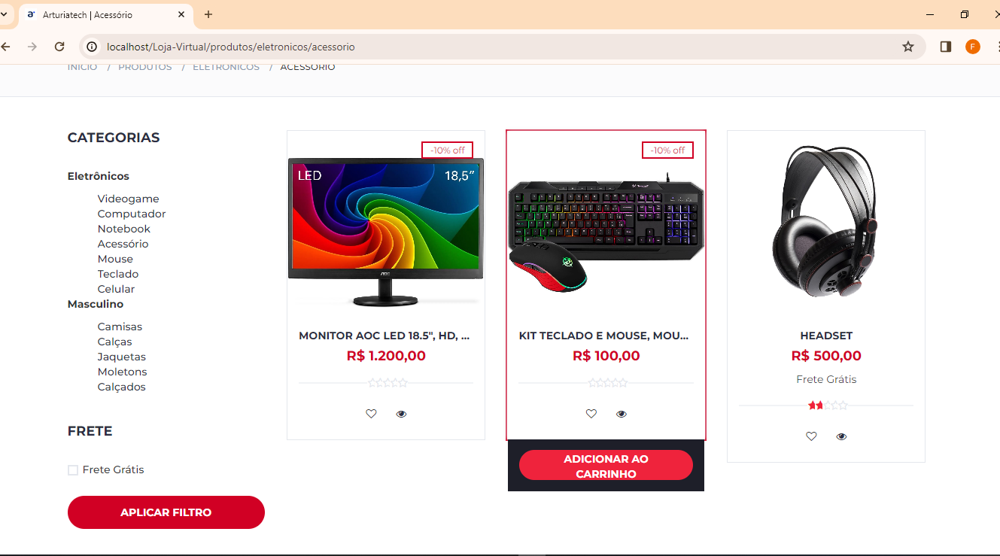

### CARRINHO

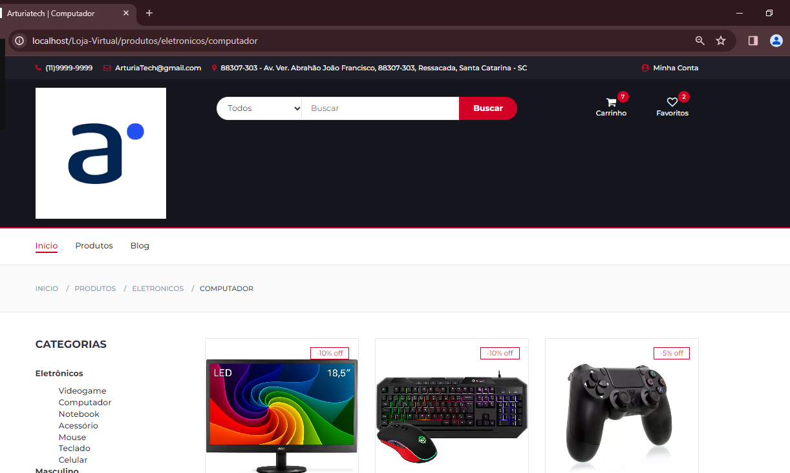


### FAVORITOS


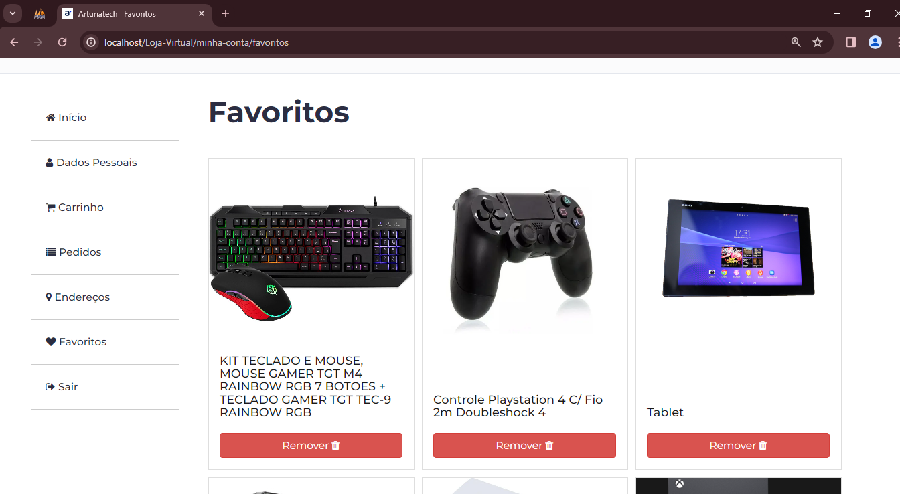


### VISUALIZAÇÃO DE PRODUTO


"# lojavirtualArturia"  "# lojavirtualArturia" 
"# lojavirtualArturia" 
